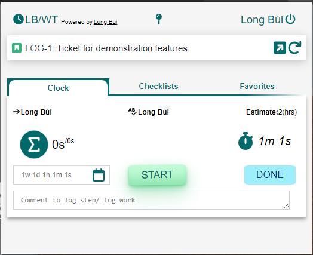
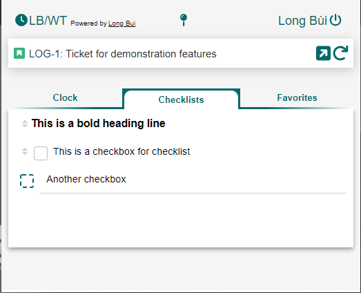
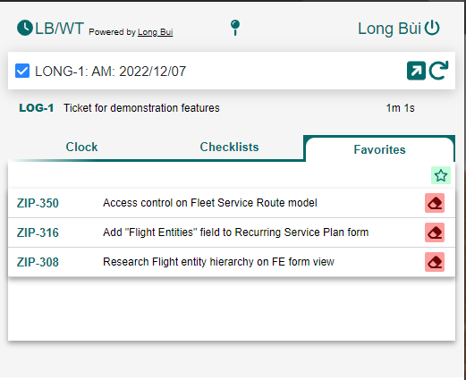

# Chrome's Work Tracking Extension.

In this project, I am proposing a feature for end-user lazying like me. Because that takes to long for me to open our time management system and log what I have just done. 

I am also provide a system for you to doing a time management tracking with so many impressive features. Contact me for futher information.

Public on: [Chrome Web Store](https://chromewebstore.google.com/detail/work-tracking/hbdlfjpejllfdkialkdalibmhcehoflk)

## Main Features
### General
- Sign in to server (no matter that's cloud or not, but you probably need to use https:// domain for the server)
- Search tasks/tasks that we would want to working on.
### Clock Traking

- View the total duration of all people, view your total duration and your active duration so far.
- View assignee, tester, status of the task/task
- Add comment for task
- Manually log time if you don't want to track or you didn't start tracking time.
- Log to the specific date. (default is the noon of the user's browser timezone)
- Start, Pause, Stop tracking time.
- View all related active tasks and navigate to related task by clicking at their task key.
### Checklists

- Write checklist for the particular task.
- Reorder checklists.
- Toggle between checklist header and checkbox.
- Bold **(Ctrl + B)** and Italic **(Ctrl + I)** is acceptable. 
### Favorites

- Add/Remove from favorite/todo list.
- Navigate to favorite task by clicking on their task-key

## Keyboard Shortcuts
- **Ctrl + Shift + Digit[1,3]**: To navigate to the particular tab.

### Tab 1: Clock
- **Ctrl + Shift + Alt**: For pinning extension to main page view.
- **Ctrl + Shift + F**: For move to searching board.
- **Ctrl + Shift + E**: To export current tab to the original server.
- **Ctrl + Shift + MouseClick** at the export icon: To export current tab to the original server.
- **Ctrl + Alt + Space**: For toggling extension.
- **Ctrl + Alt + Click** at the clock icon: To cancel current logs.
- **Ctrl + Enter**: To perform done work log.
### Tab 2: Checklist
- **Ctrl + ?/**: To togger checklist between header and checked box.
- **Ctrl + Delete/Backspace** at the empty line: To delete the particular checklist.
- **Move Up/ Move Down**: To change the checklist.
- **Enter**: To create new checklist under current checklist.
- **Ctrl + Enter**: To save current checklist to the server.
## For Developer.   
[WIP] ...
